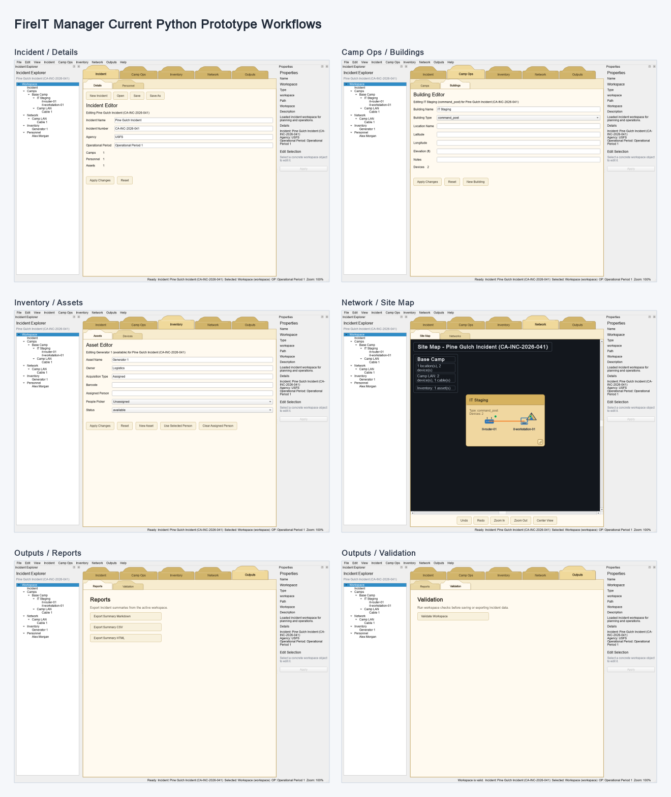

# Current Python Prototype Workflows

Last updated: 2026-07-28

This note records the current FireIT Manager Python prototype screens and the
core workflows they support. It is Phase 1 evidence for documenting the working
prototype before deciding what must carry forward into the future implementation.

## Screenshot Evidence

The screenshot captures these representative screens from the demo incident:

- Incident / Details
- Camp Ops / Buildings
- Inventory / Assets
- Network / Site Map
- Outputs / Reports
- Outputs / Validation

## Current Prototype Baseline

The prototype opens with a representative demo incident named Pine Gulch
Incident. The workspace uses folder-style navigation with five top-level
workflow areas:

- Incident
- Camp Ops
- Inventory
- Network
- Outputs

The left Incident Explorer remains visible across workflows and shows the
workspace hierarchy: incident, camps, buildings, devices, network, cables,
inventory, and personnel. The right Properties pane shows selection details and
provides direct editing when a concrete incident object is selected.

## Incident Workflow

Incident / Details is the main entry point for incident metadata. The prototype
supports editing the incident name, incident number, agency, and operational
period. Applying changes updates the in-memory incident model and refreshes the
status bar, editor summaries, explorer context, and dependent screens.

The File menu and Incident toolbar support creating a new incident, opening an
incident JSON file, saving the active workspace, saving as a new file, and
reopening recent files.

## Camp Operations Workflow

Camp Ops contains screens for camps and buildings. The building editor currently
captures building name, building type, optional location details, coordinates,
elevation, notes, and the number of attached devices.

Building edits update the active incident model and refresh the explorer tree,
properties pane, editor summaries, and Network / Site Map.

## Inventory Workflow

Inventory contains assets and devices. The asset editor captures asset name,
owner, acquisition type, barcode, assigned person, people picker selection, and
asset status.

The prototype can assign and clear people relationships from assets while
keeping the model in memory until the workspace is saved.

## Network Workflow

Network / Site Map visualizes the active camp network. It currently renders the
IT Staging building, attached network devices, a cable connection, device icons,
and a pinned summary overlay.

The site map supports draggable devices, resizable location/building boxes,
anchored equipment, cable redraws as nodes move, zoom controls, center view,
undo, and redo.

The Network / Networks editor captures the active network name and keeps the
network model synchronized with the rest of the workspace.

## Outputs Workflow

Outputs / Reports exposes export actions for incident summaries:

- Markdown summary
- CSV summary
- HTML summary

Outputs / Validation runs workspace checks before saving or exporting incident
data. The current demo incident validates successfully.

## Phase 1 Notes

The current prototype demonstrates the major product areas needed for Phase 1:
incident details, camp operations, inventory, network views, reports, and
validation. This documentation does not decide which prototype features are
permanent or temporary. That decision belongs to the next Phase 1 work items.
